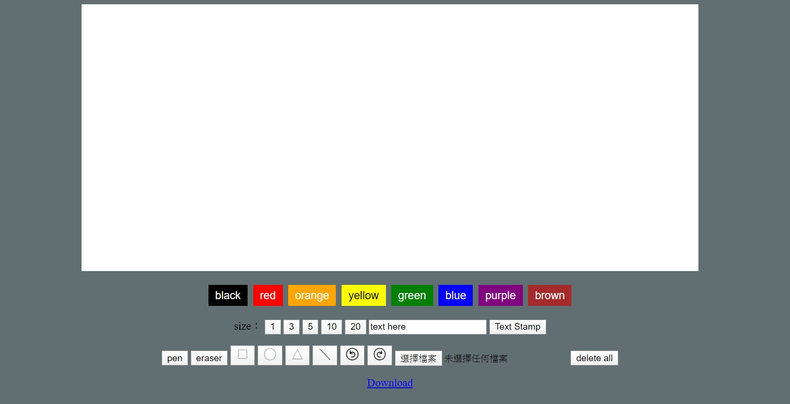

# Software Studio 2018 Spring Assignment 01 Web Canvas

## Web Canvas
### By 張子宜

# 作品網址：https://106062123.gitlab.io/AS_01_WebCanvas

## Description
* color
    * 八種顏色
    * 改變 pen, rectangle, circle, triangle, line 以及 text 的顏色
* size
    * 五種大小
    * 改變 pen, rectangle, circle, triangle, line 的粗細 以及 text 的大小
* text
    * 在文字框中輸入文字
    * 按下 Text Stamp
    * 即可在畫布上隨意貼上文字
* pen
* eraser
* rectangle
* circle
* triangle
* line
    * 畫直線
* undo
* redo
* upload picture
    * 選擇圖片檔上傳
* delete all
    * 清空畫布
* Download
    * 下載目前作品到電腦上

